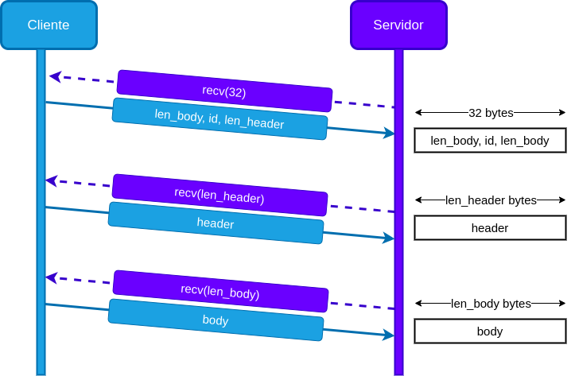

# TP 1 - Protocolo DBUS | Taller 7542

## Trabajo práctico 1 - Implementación del protocolo DBUS 

### Taller de programación 75.42 - FIUBA

- Alumno: Agustín Emanuel More
- Padrón: 102914
- Repositorio github: https://github.com/moreover22/tp1-taller

Contenidos
---


Introducción
---

El trabajo práctico tiene como objetivo dominar el manejo de sockets, archivos y cadenas en C. Para ello se deberá implementar parte del protocolo [DBUS] (Desktop Bus) que comunica procesos dentro del sistema operativo. Además, se deben conseguir implementaciones abstractas y encapsuladas.

Lectura de archivos
---
Los comandos seran leidos desde un archivo cuya ruta fue pasada por parámetro (o del `stdin` si ninguno fue especificado). Cada comando se encuentra en una línea distinta, es decir están separados por el carácter `\n` o salto de línea. Un primer acercamiento para poder obtener el comando es: leer el comando carácter por carácter hasta toparse con el salto de línea. En ese caso, copiar esa información a un buffer y luego transmitirla con el protocolo. Sin embargo, esto no es eficiente, como la función `read` para leer de un archivo, es una función costosa, como el resto de las `syscalls`, se espera ejecutarla el menor número de veces posibles. 

Otra manera de encarar el problema, reduciendo las llamadas a `read`, es leer de más de un byte, en este caso se elije leer 32 bytes. Esos 32 bytes se almacenana en un buffer estático (siempre tiene espacio para 32 bytes), una vez leído, se analiza si se llega al final de línea. En el caso de que no se haya encontrado, se almacenan esos 32 bytes en un buffer dinámico (este irá creciendo a medida que se agregan carácteres, en esta implementación, que se puede encontrar en `common_bufferdinamico`, con un factor `REDIM_PROP = 1.5`) y se sigue leyendo. Caso contrario, se encontró el carácter de salto de línea:
 - Se almacenan los bytes hasta el `\n` en el buffer dinámico.
 - Los bytes restantes, se almacenan en otro buffer estático de 32 bytes, que se tendrán en cuenta en la siguiente iteración.

En la siguiente iteración, si hay algo en el segundo buffer estático, se almacena su contenido en el dinámico y se sigue con el bucle.

Una vez obtenido un comando, el mismo se codifica según el protocolo y se envía al servidor.


Socket | Cliente - Servidor
---

En el trabajo se implementó una librería dedicada exclusivamente a los sockets (`common_socket`), la cual fue diseñada para que esté abstraida de este tp en particular y pueda ser usada en futuras oportunidades.

La misma cuenta con funciones génericas: constructor y destructor, una función para recibier y otra para enviar, funciones para la conexión tanto del cliente (`connect`), como para el servidor (`accept`, `bind_and_listen`). 

Este TDA, permite abstraerse de las consideraciones que hay que tener al momento de trabajar con sockets: resolver nombres de dominio, resolver nombres de servicios, intentar conectarse por múltiples caminos (hasta extablecer la conexión), enviar el mensaje la cantidad de veces necesarias para que el mensaje enviado sea el correcto.

Como una capa mayor de abstracción, se implementaron los TDA *client* (`clientlib`) y de *server* (`serverlib`), evitando así trabajar directamente con el TDA `socket`.


El protocolo DBUS
---

El protocolo brinda una serie de reglas que al momento de codificar las mensajes que serán intercambiados entre los procesos. El mismo cuanta con un `header` y un `body`.

El `header` contiene:
 - En los primeros 4 bytes, información del protocolo y el _endianness_ del mensaje (esto es, si es _little endian_ o _big endian_). En este tp se trató completamete la información en _little endian_ (aunque el programa es compatible en ambas _endianness_).

 Ejemplo de de primeros cuatro bytes del `header`:
 
 ```
 |6C 01 00 01             |                         |  |l...            |
 ```

[Aclaración: En el panel de la izquierda, se encuentra los bytes expresados en hexadecimal y a la derecha su correspondiente equivalente en ASCII (si el caracter no tiene significado en la explicación, se representa con '.'). Formato similar al de el editor [hexed](https://hexed.it/) ].

Donde el primer `6C` corresponde al carácter en [ASCII] 'l'. Luego, `01 00 01` corresponden a `llamada a método`, `sin flags` y `versión del 1 protocolo` respectivamente. Estos primeros bytes permanecerán constantes para esta implementación del protoco.

- Pasados esos bytes, se encuentran tres campos importantes:

```
 |6C 01 00 01 D6 00 00 00 | 06 00 00 00 A6 00 00 00 |  |l................|
```

Los primeros 4 bytes fueron analizados previamente, los siguientes `D6 00 00 00` expresa el número D6<sub>16</sub> (expresado en _little endian_) que equivale a 214<sub>10</sub>, esto indica que el cuerpo del mensaje (el que contiene los parámetros), tiene dicha longitud medida en bytes. Los siguientes 4 bytes o palabra `06 00 00 00`, se trata del id del mensaje, en este caso 6<sub>16</sub> = 6<sub>10</sub>.

- Después de estos 16 bytes o 4 palabras de 4 bytes, se cuenta con parametros definidas por el protocolo. Sin entrar en detalle son de la forma:

```
 |06 01 73 00 12 00 00 00 |                         |  |..s.....        |
```

Donde el primer byte, `06`, indica que es un argumento de tipo `Destino`, el caracter 's' (73<sub>16</sub> en ASCII) indica que será un argumento de tipo cadena (para esta implementación siempre será el caso). Los siguientes 4 bytes mostrarán la longitud del argumento, en este caso 12<sub>16</sub> = 18<sub>10</sub>. Luego de estas dos palabras, se encuentra el argumento en sí:


```
 |06 01 73 00 12 00 00 00 | 74 61 6C 6C 65 72 2E 64 |  |..s.....taller.d|
 |62 75 73 2E 70 61 72 61 | 6D 73 00 00 00 00 00 00 |  |bus.params......|
```

Como se ve, se completa con ceros hasta completar dos palabras (completar a 8 bytes), esto es un requerimiento que establece el protocolo y deben ser contados en la longitud del `header` salvo para el último argumento.

- Para los siguientes argumentos, `Ruta`, `Interfaz` y `Método` el procedimiento es análogo. Finalmente, la `Firma`, que es opcional, cambia ligeramente el formato, los primeros 4 bytes se forman de la misma manera, pero los siguientes bytes consisten en un byte indicando la cantidad de parametros que tiene el método y un carácter 's', por cada uno.

- El `body` cuenta con un estructura más simple, una palabra indicando la longitud del parámetro y el parámetro en cuestión finalizado con un carácter nulo.

El protocolo se encuentra más detallado en la documentación [DBUS], o en el enunciado del tp.

De este análisis del protocolo, se tomaron las siguientes decisiones:
- Como los primeros 16 bytes contienen la información del tamaño del resto del cuerpo, se procede a hacer un `recv` de esos primeros bytes en un buffer estático y luego en base a esa información ya sé cuántos bytes tengo que recibir después, sin tener que esperar a que cierren el socket del otro lado. Además de poder reservar la memoria justa para almacenar los mensajes. Como se muestra en el siguiente diagrama:

<p align="center"> 
    
</p>

- Todos los campos fijos detallados anteriormente son de 8 bytes o múltiplos de 8, entonces, solamente debo alinear los argumentos y además no me tengo que fijar en qué posición estoy escribiendo porque puedo estar seguro que lo anterior tiene que estar alineado.

- Todos los argumentos siguen el mismo patrón, con lo cual al momento de implementar un interprete (en el código `server_dbusinterpreter`) la extracción de datos es bastante directa:
  - Dado un argumento:
    - Se leen los primeros 4 bytes y se determinan el tipo de argumento.
    - Se leen otros 4 bytes y se determina la longitud.
    - Se lee la siguiente longitud + padding correspondiente.
  - Dado un parámetro:
    - Se leen los primeros 4 bytes, determinando así la longitud.
    - Se leen los siguientes bytes determinados por la longitud.


Referencias
---
[DBUS]: https://www.freedesktop.org/wiki/Software/dbus/
- Especificaciones DBUS: https://www.freedesktop.org/wiki/Software/dbus/

[ASCII]: https://www.rapidtables.com/code/text/ascii-table.html
- Tabla ASCII: https://www.rapidtables.com/code/text/ascii-table.html
